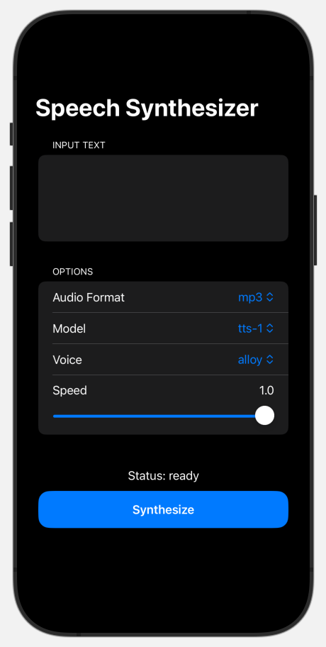

# speech-synth-openai
A demonstration of speech synthesis using Swift and OpenAI.

Technologies used:
* SwiftUI
* AVAudioPlayer
* OpenAI



## Pre-requisite to building and running
Add an `APIKeys.swift` file to your project and set your OpenAPI Key.
```
// APIKeys.swift
import Foundation

enum APIKeys {
    static let openAI = "YOUR-OPENAPI-KEY"
}
```